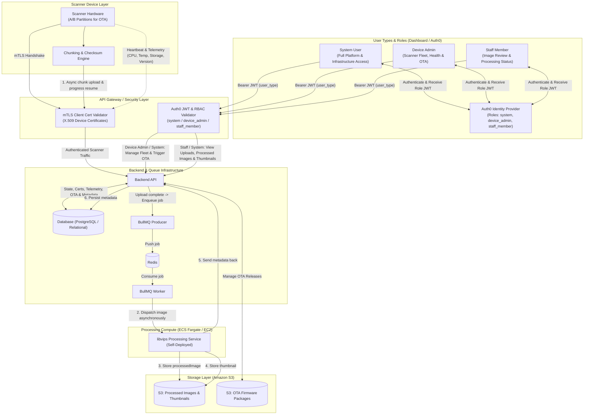
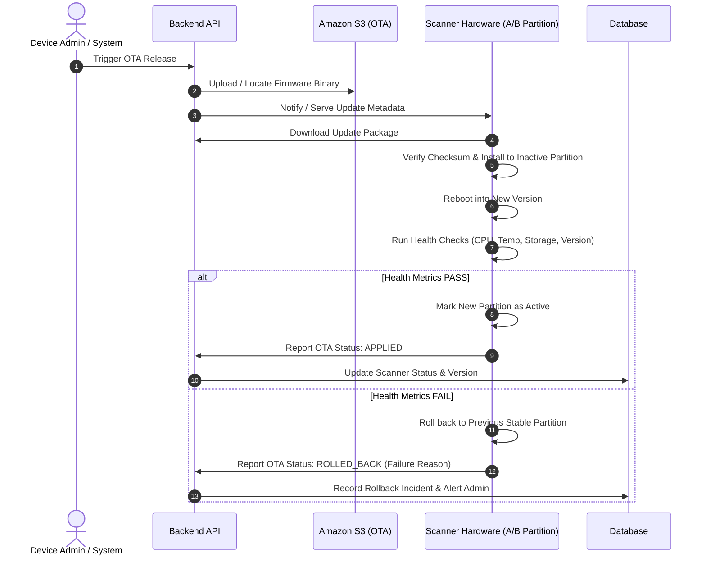

# System Architecture

## Overview
This document specifies the system architecture for an image scanning, resumable chunked upload, asynchronous processing pipeline with **libvips**, S3 storage, certificate-based scanner authentication, Auth0 dashboard authentication, device health monitoring, and OTA update rollback capabilities.

---

## 1. High-Level Architecture Diagram

---

## 2. Component Workflows

### 2.1 Chunking & Resumable Async Upload (Part 1)
1. **Image Partitioning**: Scanner divides large, high-resolution scans into chunks.
2. **Session / Resume Verification**: Scanner queries the Backend API using image identifiers. If previous transmission failed, Backend returns `last_uploaded_chunk_index` to resume without restarting from scratch.
3. **Async Upload**: Scanner uploads chunks asynchronously, with each chunk receipt updating progress in the database.

### 2.2 Async Event Queue & libvips Compute (Part 2)
1. **BullMQ Enqueue**: When the final chunk is received, the Backend acknowledges the client and pushes an image processing job into **BullMQ** (persisted in **Redis**).
2. **libvips Dispatch**: The **BullMQ Worker** consumes the task and dispatches the raw image asynchronously to the self-deployed **`libvips`** service on **AWS ECS Fargate / EC2**.

### 2.3 Storage & Metadata Persistence (Part 3)
1. **Output Generation**: `libvips` creates `processedImage` and `thumbnail`.
2. **Direct S3 Upload**: `libvips` uploads both image assets directly to **Amazon S3**.
3. **Metadata Callback**: `libvips` sends image dimensions, sizes, formats, and S3 keys back to the Backend API.
4. **Database Persistence**: Backend saves the image metadata into the database.

---

## 3. Security & Authentication Architecture

- **Scanner Device**: Authenticates over mutual TLS (**mTLS**) using device-specific X.509 client certificates. Validated at the API Gateway / Reverse Proxy.
- **Dashboard Users**: Authenticate through **Auth0** (OIDC/OAuth2) with Bearer JWT tokens. RBAC roles enforced:
  - `system`: Unrestricted platform access and auditing.
  - `device_admin`: Scanner fleet provisioning, health tracking, and OTA updates.
  - `staff_member`: Access to scan workflows, thumbnails, and processed images.

---

## 4. OTA (Over-The-Air) Update & Health Validation Flow

