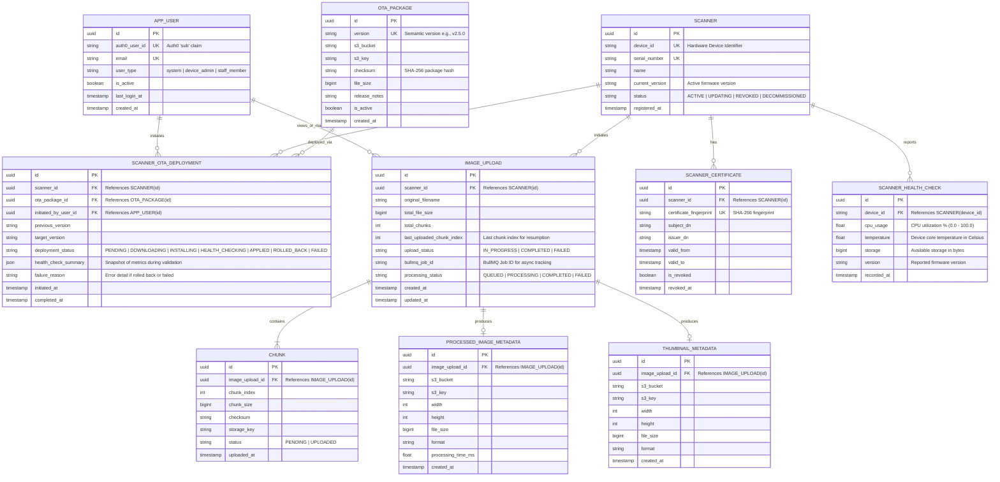

# Entity Relationship Diagram (ERD)

## Overview
This document contains the Entity Relationship Diagram (ERD) and database schema specification for the image scanning, chunk upload, processing, device health telemetry, and OTA deployment platform.

---

## 1. Complete Entity Relationship Diagram

---

## 2. Table Specifications & Data Dictionary

### `APP_USER`
Stores dashboard users authenticated via Auth0.
- `id`: Unique identifier (UUID).
- `auth0_user_id`: Auth0 subject claim (`sub`) used to authenticate incoming JWT tokens.
- `email`: User email address.
- `user_type`: Role-based classification (`system`, `device_admin`, `staff_member`).
- `is_active`: Account status flag.

### `SCANNER`
Hardware scanner registry.
- `id`: Unique internal ID.
- `device_id`: Hardware unique ID sent by the scanner.
- `serial_number`: Device hardware serial.
- `current_version`: Currently running firmware/software version.
- `status`: Device operational state.

### `SCANNER_HEALTH_CHECK`
Periodic scanner telemetry received from hardware devices.
- `id`: Health check entry ID.
- `device_id`: Device identifier reporting metrics.
- `cpu_usage`: CPU usage percentage.
- `temperature`: Thermal measurement in °C.
- `storage`: Free disk space in bytes.
- `version`: Installed version during health check.
- `recorded_at`: Ingestion timestamp.

### `SCANNER_CERTIFICATE`
Tracks X.509 client certificates used for mTLS authentication.
- `certificate_fingerprint`: Unique fingerprint of the client cert.
- `valid_from` / `valid_to`: Certificate validity window.
- `is_revoked`: Revocation status flag.

### `OTA_PACKAGE` & `SCANNER_OTA_DEPLOYMENT`
Manages firmware distribution and rollback tracking.
- `OTA_PACKAGE`: Contains version, S3 location, and SHA-256 checksum of firmware builds.
- `SCANNER_OTA_DEPLOYMENT`: Records per-device rollout state (`HEALTH_CHECKING`, `APPLIED`, `ROLLED_BACK`), snapshot of health checks, and rollback reasons.

### `IMAGE_UPLOAD` & `CHUNK`
Coordinates chunked, resumable image uploads.
- `last_uploaded_chunk_index`: Allows the scanner to resume from the last saved chunk after connection interruption.
- `bullmq_job_id`: Links upload session to the asynchronous BullMQ processing job.

### `PROCESSED_IMAGE_METADATA` & `THUMBNAIL_METADATA`
Stores metadata returned from `libvips` after image transformations and direct S3 uploads.
- Holds S3 bucket, S3 key, dimensions (width, height), byte size, and format.
