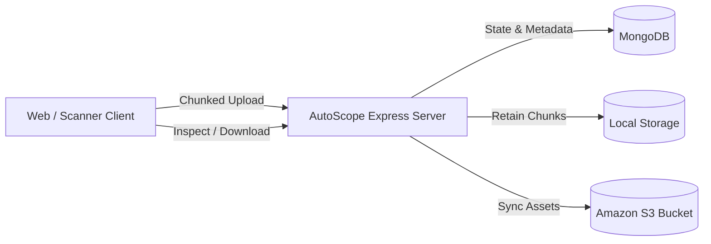

# AutoScope Server Documentation Hub

Welcome to the **AutoScope Platform Documentation**. AutoScope is a high-throughput medical and laboratory specimen scanning, resumable chunked upload, and image deployment platform.

---

## 📚 Documentation Index

| Document | Description |
| :--- | :--- |
| [**Architecture**](/docs/ARCHITECTURE) | System topology, component workflows, BullMQ queue, libvips compute, and security layers. |
| [**Entity Relationship Diagram (ERD)**](/docs/ERD) | Complete relational & document database schemas for scanners, chunks, uploads, and artifacts. |
| [**REST API Reference**](/docs/API) | Endpoints specification, request/response bodies, curl examples, and resumption flows. |
| [**Storage & S3 Pipeline**](/docs/STORAGE_PIPELINE) | Client-side chunk slicing, stream reassembly, AWS S3 cloud synchronization, and chunk retention. |
| [**Setup & Deployment Guide**](/docs/SETUP_GUIDE) | Step-by-step setup for local development, MongoDB, AWS S3 IAM credentials, and seeding. |

---

## 🚀 Key Highlights & Capabilities

- **Resumable Chunking**: Handles multi-gigabyte specimen scans by slicing them in the client and streaming them in manageable binary chunks. Automatically resumes from `last_uploaded_chunk_index` in case of network drops.
- **Permanent Chunk Retention**: Retains all raw binary chunks on disk under `uploads/chunks/<uploadId>/` for verification, audit trails, and resumption checks.
- **Amazon S3 Cloud Synchronization**: Assembled images and thumbnails are streamed directly to Amazon S3 (e.g., bucket `vectorstoretj`) using AWS SDK v3.
- **S3 Fallback & Direct Streaming**: If local cache files are purged or deleted from disk, the server transparently fetches and streams the image directly from Amazon S3.
- **MongoDB Persistence**: Mongoose-backed data models for `Scanner`, `ImageUpload`, `ImageChunk`, and `ImageArtifact`.
- **Fleet Seeding**: Interactive CLI (`npm run seed`) and REST API (`POST /api/scanners/seed`) to provision realistic scanner devices.
- **Interactive Single-Page UI**: Built-in visual demo application at `http://localhost:3000` with drag-and-drop chunk upload visualizer and artifact inspector.

---

