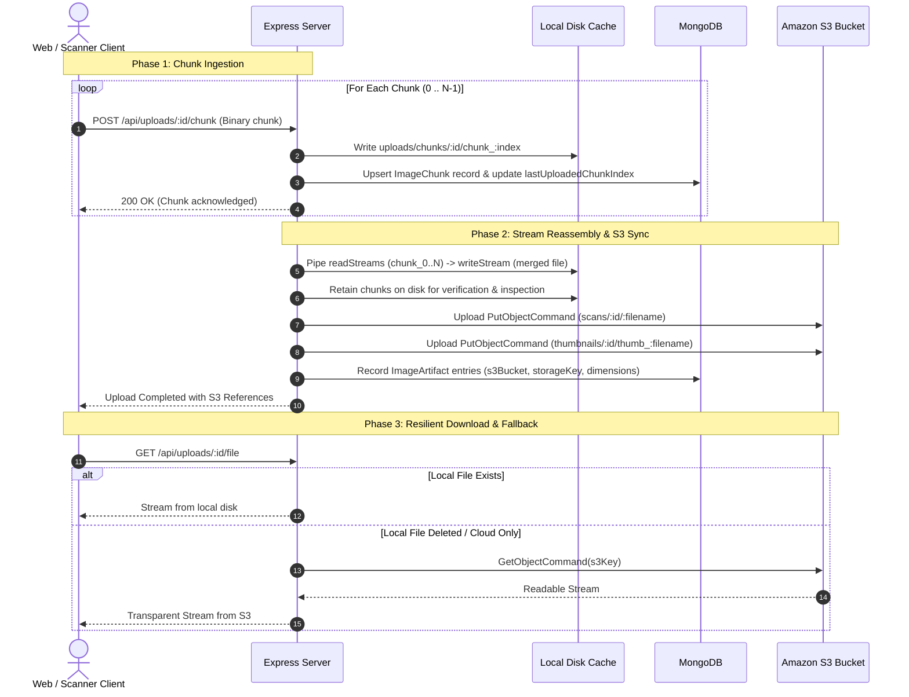

# Storage & Amazon S3 Pipeline

AutoScope implements a hybrid storage model combining **local disk chunk caching**, **stream reassembly**, and **Amazon S3 cloud synchronization**.

---

## Storage Architecture Diagram



---

## 1. Client-Side Chunking
High-resolution scans (e.g. 50 MB to multiple GBs) are partitioned in the browser or device client using `Blob.slice()`:
- Chunk size is configurable (e.g., 256 KB, 512 KB, 1 MB, 2 MB).
- Each chunk is transmitted with its 0-indexed position and binary payload.
- If connectivity drops, client queries `GET /api/uploads/:id/status` and resumes from `lastUploadedChunkIndex + 1`.

---

## 2. On-Disk Chunk Retention
Unlike traditional systems that discard chunks immediately upon assembly, AutoScope retains all raw chunks under:
```
uploads/chunks/<uploadId>/
├── chunk_0
├── chunk_1
└── chunk_N
```
This guarantees:
- Full traceability and verification that real slicing occurred.
- Ability to download and inspect individual chunks via `GET /api/uploads/:id/chunks/:index`.

---

## 3. Amazon S3 Cloud Storage
- Configured via `@aws-sdk/client-s3` (AWS SDK v3).
- **Target Keys**:
  - Full Images: `scans/<uploadId>/<filename>`
  - Thumbnails: `thumbnails/<uploadId>/thumb_<filename>`
- **Direct S3 Streaming Fallback**: If files are deleted from the local server cache, the server automatically issues a `GetObjectCommand` to your S3 bucket (e.g., `vectorstoretj`) and pipes the remote stream directly to the client with `200 OK`.
